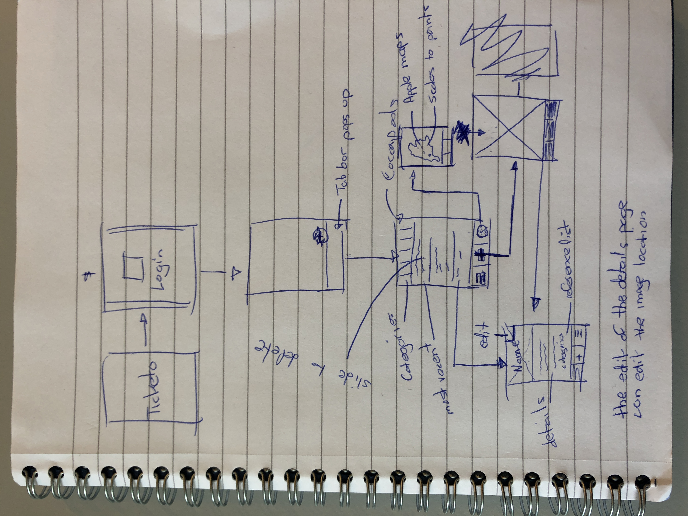

# Ticketo

Ticketo is een app waar de gebruiker bonnetjes kan inscannen om deze op een centrale plek te bewaren. Hiermee gaan bonnetjes nooit verloren.

**Voordelen:**

- Inkt vervaagt niet van de bonnetjes
- De bonnetjes kunnen in veschillende categorieën gezet worden (automatisch/handmatig?)
- Met behulp van geolocatie is het bekend waar de aankoop was
- Totaalbedragen kunnen berekend worden
- Bonnetjes staan veilig achter een login

**Must:**

- De gebruiker moet kunnen inloggen (Nils)
- De gebruiker kan een foto maken van de bon (Lucas)
- De gebruiker kan de details van de bon bekijken (Lucas)
- De gebruiker kan de details van de bon bewerken (Lucas)
- De gebruiker kan de bon verwijderen (Nils)

**Should:**

- De app kan de bon uitlezen met OCR (Nils)
- De gebruiker kan de bonnen categoriseren (Lucas)
- De app kan de bon categoriseren (Lucas)

**Could:**

- De app kan totaalbedragen weergeven (Lucas)
- De app kan de locatie van de bon op een map weergeven (Nils)
- De gebruiker kan de locatie van de bon aanpassen (Nils)
- De gebruiker kan meerdere foto’s toevoegen aan een bon (Lucas) (Image Slider where there is a default)

SwiftOCR: <https://github.com/garnele007/SwiftOCR>

Vision Framework: <https://www.appcoda.com/vision-framework-introduction/>

Core ML: <https://www.appcoda.com/coreml-introduction/>

Voorbeelden:

- [Shoeboxed.com](http://Shoeboxed.com)

Frameworks gaan testen

- Tabbar
- Manier opslaan data? Op telefoon? Singleton? Externe DB? Custom TabbarViewController?
- De categorieën view kan gemaakt worden met UICollectionView (<https://www.youtube.com/watch?v=SL1ZmIp83iI>) 

